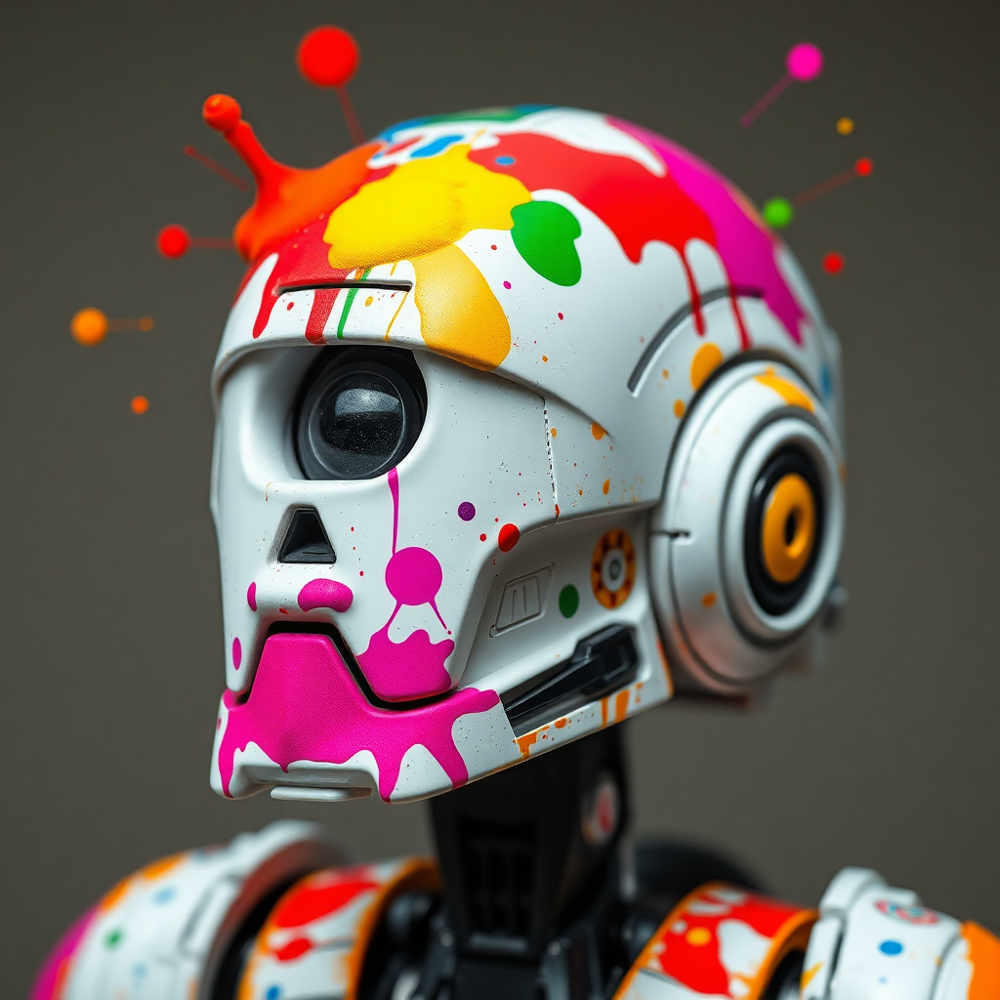

<p align="center">
  <a href="">
    
  </a>
</p>
<h1 align="center"> DROID-Splat </h1> 
Combining dense end-to-end SLAM with dense 3D Gaussian Splatting.

## :clapper: Introduction
This is a deep-learning-based dense visual SLAM framework that achieves **real-time global optimization of poses and 3D reconstruction**.   
- SotA Tracking from [DROID-SLAM](https://github.com/princeton-vl/DROID-SLAM)
- Integration of monocular depth estimation priors like [Metric3D](https://github.com/YvanYin/Metric3D)
- Dense differentiable Rendering with [3D Gaussian Splatting](https://github.com/graphdeco-inria/gaussian-splatting)
- We also support the optimization kernel from [DroidCalib](https://github.com/boschresearch/DroidCalib), which supports arbitrary camera models and optimizes the camera intrinsics on top of the map and pose graph.

## :memo: Code

You can create an anaconda environment called `droidsplat`. For linux, you need to install **libopenexr-dev** before creating the environment.
```bash

git clone --recursive https://github.com/ChenHoy/DROID-Splat.git

sudo apt-get install libopenexr-dev
    
conda env create -f environment.yaml
conda activate droidsplat

pip install git+https://github.com/NVlabs/tiny-cuda-nn/#subdirectory=bindings/torch
pip install evo --upgrade --no-binary evo

python setup.py install
```
We recommend to create a separate virtual environment for depth inference, see their respective repositories. 

## :question: How to use this framework?
We support multiple input modes in our paper: :new_moon: mono, :first_quarter_moon: prgbd, :full_moon: rgbd. 

P-RGBD refers to Pseudo-RGBD, where we use a monocular depth prediction from an off-the-shelf network  
like [Metric3D](https://github.com/YvanYin/Metric3D), [ZoeDepth](https://github.com/isl-org/ZoeDepth) or [DepthAnything](https://github.com/LiheYoung/Depth-Anything). 

Basic inference can be run with
```
python run.py data=Replica.base data.input_folder=/media/data/Replica/office0 tracking=base stride=1 mode=rgbd
```
Our configuration system is based on [Hydra](https://github.com/facebookresearch/hydra), which allows elegant command line manipulation. Since our system is quite complex, we are showing a few basic use cases below. Feel free to dig into the ```/configs/...``` files to see options for each component!

### Setting up a dataset
We assume a very basic structure for your own dataset: 
```bash
My Dataset
├── images
│   ├── frame_0001.png
│   ├── frame_0002.png
│   ├── frame_0003.png
|   ...
│   └── frame_1000.png
├── metric3d-vit_giant2
│   ├── frame_0001.npy
│   ├── frame_0002.npy
│   ├── frame_0003.npy
|   ...
│   └── frame_1000.npy
├── depth
│   ├── frame_0001.png
│   ├── frame_0002.png
│   ├── frame_0003.png
|   ...
│   └── frame_1000.npy
└── raw.mp4
```

Monocular depth inference can be run by using the ```demo.py``` scripts in the respective forks.

### Multi-threading
We run multiple components in parallel based on concurrency. 
- All threads follow the leading _Frontend_. 
- The _Loop Detector_ will check visual similarity to past frames for each incoming frame.
- How often the _Backend_ and _Renderer_ are run is determined by ```backend_every``` and ```mapper_every```. 

We synchronize the threads, such that the Backend truly runs in parallel, but the Frontend will wait until a Rendering pass is finished.  
This sacrifies a few FPS for additional stability/robustness.

### How to configure your Tracker
Our Tracker consists of three components: 
- $\color{BurntOrange}{\textbf{Frontend}}$
- $\color{BurntOrange}{\textbf{Backend}}$
- $\color{BurntOrange}{\textbf{Loop Detector}}$.
 
They can be disabled with ```run_backend=False```, ```run_loop_detection=False```. 

The system can be modified flexibly. **Example**:  
<p align="center"> Optimize the scales of a depth prior in :first_quarter_moon: prgbd mode by using <code>tracking.frontend.optimize_scales=True</code> </p>


#### Tips & Tricks 
The most important properties of the Tracker are how to build and maintain the $\color{BurntOrange}{\textbf{Factor Graph}}$:
- The motion threshold and keyframe thresholds determine when keyframes are considered and kept: ```tracking.motion_filter.thresh```, ```tracking.frontend.keyframe_thresh``` and ```tracking.frontend.thresh```
- Factors are only kept in the optimization window for a ```tracking.frontend.max_age```. If the Frontend is not accurate, increasing this age will usually increase the window at the cost of memory and speed.  
- Limiting the number of factors determines how big the global backend optimization will finally be ```tracking.backend.max_factor_mult```, ```tracking.backend.window```

When we use the $\color{BurntOrange}{\textbf{Loop Detector}}$ to detect visually similar frames, we add these edges in addition to our global backend optimization. 
- We also support the loop closure updates from [GO-SLAM](https://github.com/youmi-zym/GO-SLAM) with
```tracking.backend.use_loop_closure```.
However, we could not achieve better results with this. We can also not confirm, that it is trivial to add more edges to the graph without affecting the optimization.

### How to use the Renderer
There are few very important parameters, that need to be tuned in order to achieve good performance: 
- $\color{Purple}{\textbf{Optimization}}$ time and optimization window: ```mapping.online_opt.iters```, ```mapping.online_opt.n_last_frames```, ```mapping.online_opt.n_rand_frames```. We recommend large batch sizes with a decent number of random frames for optimal results. The number of iterations can be set in accordance to the ```run_mapper_every```-frequency. We made the experience, that it is easier to run the Renderer with a lower frequency, but optimize for longer. Be careful to additionally change ```mapping.opt_params.position_lr_max_steps```, which determines the learning rate scheduler.
- $\color{Purple}{\textbf{Filtering}}$ the Tracker map before feeding the Renderer:  ```mapping.online_opt.filter.bin_th```. This filter can perform a multiview-consistency check to remove inconsistent 3D points or remove uncertain pixels, determined by the neural network. Additionally it is very important to use an appropriate downsampling factor: ```mapping.input.pcd_downsample```, ```mapping.input.pcd_downsample_init```. Depending on how aggressive we filter and how we grow Gaussians, we can determine the final number of Gaussians in a scene. We made the experience, that sometimes less Gaussians means better results and usually aim for ~200 - 300k Gaussians in complex indoor scenes. 
PS: If you are not careful, the system can OOM.
- How to $\color{Purple}{\textbf{grow and prune}}$ Gaussians: ```mapping.online_opt.densify.vanilla``` describes the parameters of the original [3D Gaussian Splatting](https://github.com/graphdeco-inria/gaussian-splatting) strategy. ```mapping.online_opt.pruning``` can be used for Covisibility based pruning used in [MonoGS](https://github.com/muskie82/MonoGS)
- $\color{Purple}{\textbf{Refinement}}$: Our online mode can already achieve strong results at decent FPS. If you want more, you can always refine the map once the Tracker is finished with ```mapping.refinement```. We already achieve strong results with just 500 refinement iterations.

### In-the-wild inference
We support $\color{Pink}{\textbf{Camera Calibration}}$, explored in [DroidCalib](https://github.com/boschresearch/DroidCalib) for videos with unknown intrinsics. This allows you to run on any cell phone video. You can activate it with ```opt_intr=True```. If no camera intrinsics are provided in ```configs/data/Dataset/data.yaml```, then we use a heuristic according to the image dimensions. Given enough diverse motion in the scene, this already allows to converge to correct intrinsics. 

However, since this is much easier in :full_moon: ```rgbd``` mode, we recommend to use monocular depth predictions on in-the-wild video. Using the scale-optimization together with intrinsics will result in degenerate solutions. Therefore, similar to other papers [RobustDynaNeRF](https://github.com/facebookresearch/robust-dynrf), 
we recommend a two-stage strategy: 
1. Run the system $\color{Pink}{\textbf{without scale-optimization}}$ in :first_quarter_moon: ```prgbd``` mode: ```python run.py tracking=base stride=1 mode=rgbd opt_intr=True tracking.frontend.optimize_scales=False```.  
This will return converged intrinsics. When using the [Metric3D](https://github.com/YvanYin/Metric3D) predictions, the results can even be scale-accurate! 
2. Update the intrinsics and run the whole system in :first_quarter_moon: ```prgbd``` mode $\color{Pink}{\textbf{with scale-optimization}}$. 

_PS_: Default Splatting only supports a pinhole camera model. We rectify images from non-linear camera models in our data pipeline.  
_PSS_: We did not experiment with calibration of other models, so you might need to tweak the code

### Replica
Download the data from [Google Drive](https://drive.google.com/drive/folders/1RJr38jvmuIV717PCEcBkzV2qkqUua-Fx?usp=sharing) and adjust the input in the ```configs/Replica.base.yaml```

### TUM-RGBD
Download the data from [TUM](https://cvg.cit.tum.de/data/datasets/rgbd-dataset/download) and adjust the input path in the ```configs/TUM_RGBD/base.yaml```. 

# Acknowledgments
- "**DROID-SLAM: Deep Visual SLAM for Monocular, Stereo, and RGB-D Cameras, Teed etl. al**" [Neurips 2021](https://github.com/princeton-vl/DROID-SLAM)
- "**GO-SLAM: Global Optimization for Consistent 3D Instant Reconstruction, Zhang et al**",  [ICCV 2023](https://iccv2023.thecvf.com/)
- "**Deep geometry-aware camera self-calibration from video, Hagemann et al**",  [ICCV 2023](https://iccv2023.thecvf.com/)
- "**Gaussian Splatting SLAM, Matsuki et al**",  [CVPR 2024](https://cvpr.thecvf.com/)
- "**GLORIE-SLAM: Globally Optimized RGB-only Implicit Encoding Point Cloud SLAM, Zhang et al.**", [Glorie-SLAM](https://github.com/zhangganlin/GlORIE-SLAM)

# Concurrent Work
We would like to acknowledge other works, who had the same idea and apparently blindsided us. Concurrent work [Splat-SLAM](https://github.com/eriksandstroem/Splat-SLAM) is a similar system, that combines DROID-SLAM and Gaussian Splatting. We would like to note, that we released this code earlier with its entire history to proof that we did not intend to copy their work. Some notable differences, that we observed after careful reading of their paper: 
- We support additional camera calibration with unknown intrinsics, which allows inference on in-the-wild video
- We use [EigenPlaces ICCV 2023](https://github.com/gmberton/EigenPlaces) to compute visual similarity between frames in our factor graph. We then store these features in a [FAISS](https://github.com/facebookresearch/faiss) database to find nearest neighbors and loop candidates. We would like to highlight, that at least on TUM RGBD and Replica we did not find a big improvement when adding these additional loop candidate edges to the factor graph. They seem to handle loop closures similar to [GO-SLAM](https://github.com/youmi-zym/GO-SLAM), where candidates are found from apparent motion. 
- We keep the keyframe management from [DROID-SLAM](https://github.com/princeton-vl/DROID-SLAM) based on apparent motion. They seemed to have more success by using the covisibility criterion from [MonoGS](https://github.com/muskie82/MonoGS)
- We simply reanchor the Gaussians when a significant map update from the Tracker happens, they seem to have a more involved strategy. 
- We only account for scale changes of the monocular prior in our Gaussians by reoptimization. Since the map is usually already stable when initializing Gaussians, we never have seen a problem with this. 

# References
```bibtex
@misc{teed2021droid,
  title={Droid-slam: Deep visual slam for monocular, stereo, and rgb-d cameras},
  author={Teed, Zachary and Deng, Jia},
  journal={Advances in neural information processing systems},
  volume={34},
  pages={16558--16569},
  year={2021}
}
```

```bibtex
@inproceedings{zhang2023goslam,
    author    = {Zhang, Youmin and Tosi, Fabio and Mattoccia, Stefano and Poggi, Matteo},
    title     = {GO-SLAM: Global Optimization for Consistent 3D Instant Reconstruction},
    booktitle = {Proceedings of the IEEE/CVF International Conference on Computer Vision (ICCV)},
    month     = {October},
    year      = {2023},
}
```

```bibtex
@inproceedings{hagemann2023deep,
  title={Deep geometry-aware camera self-calibration from video},
  author={Hagemann, Annika and Knorr, Moritz and Stiller, Christoph},
  booktitle={Proceedings of the IEEE/CVF International Conference on Computer Vision},
  pages={3438--3448},
  year={2023}
}
```

```bibtex
@misc{matsuki2024gaussian,
      title={Gaussian Splatting SLAM}, 
      author={Hidenobu Matsuki and Riku Murai and Paul H. J. Kelly and Andrew J. Davison},
      year={2024},
      eprint={2312.06741},
      archivePrefix={arXiv},
      primaryClass={cs.CV}
}
```

```bibtex
@misc{zhang2024glorie,
  title={Glorie-slam: Globally optimized rgb-only implicit encoding point cloud slam},
  author={Zhang, Ganlin and Sandstr{\"o}m, Erik and Zhang, Youmin and Patel, Manthan and Van Gool, Luc and Oswald, Martin R},
  journal={arXiv preprint arXiv:2403.19549},
  year={2024}

}
```

```bibtex
@misc{sandstrom2024splat,
  title={Splat-SLAM: Globally Optimized RGB-only SLAM with 3D Gaussians},
  author={Sandstr{\"o}m, Erik and Tateno, Keisuke and Oechsle, Michael and Niemeyer, Michael and Van Gool, Luc and Oswald, Martin R and Tombari, Federico},
  journal={arXiv preprint arXiv:2405.16544},
  year={2024}
}
```
